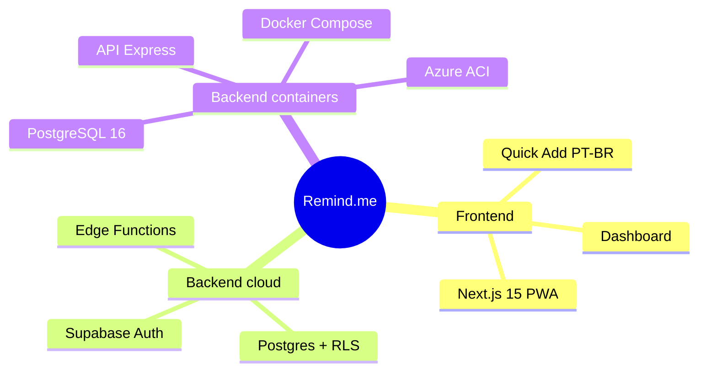
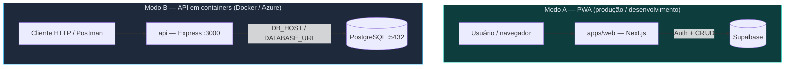
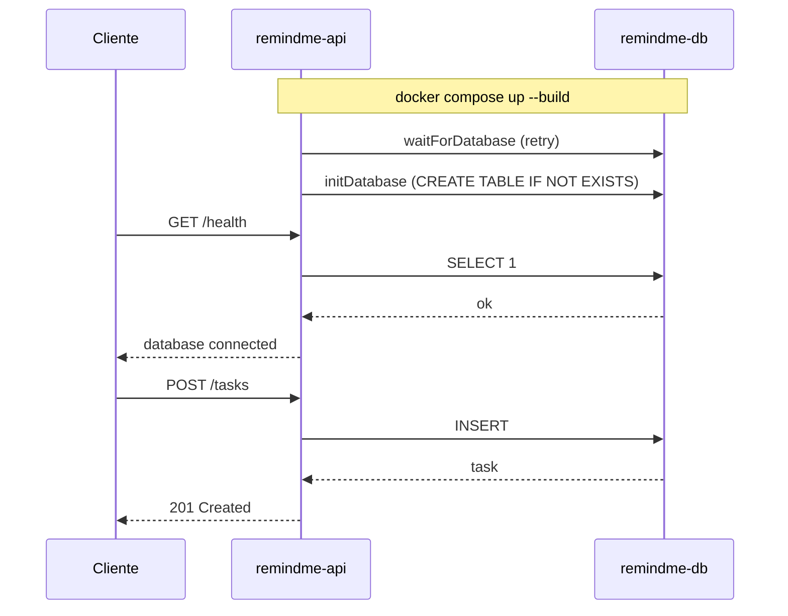
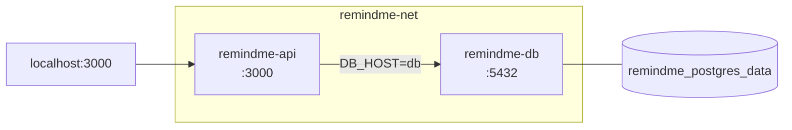
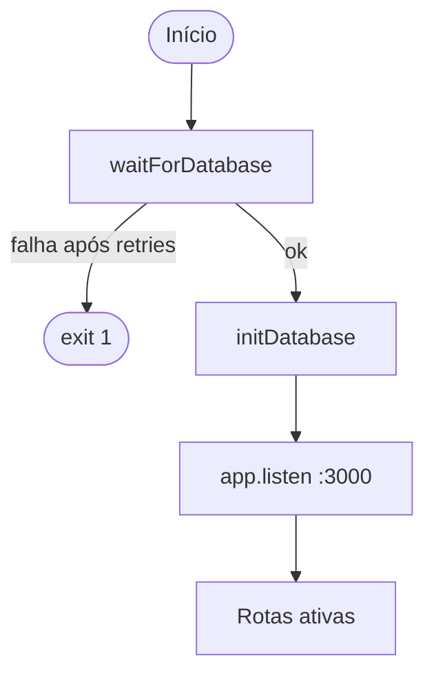
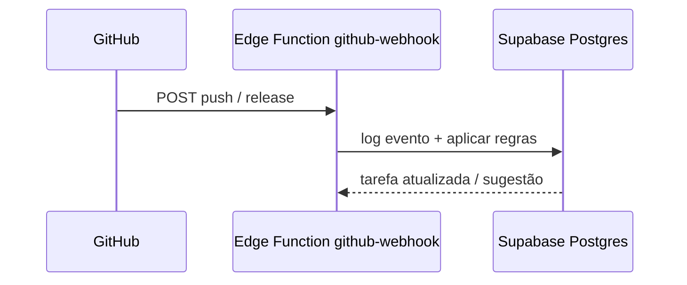
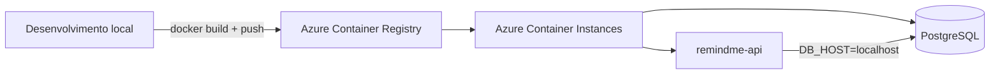

# Remind.me

PWA de organização pessoal: projetos, tarefas, lembretes, calendário e integração opcional com GitHub. O produto usa **Supabase** (auth, banco, edge functions). Há também uma **API REST em Docker** com PostgreSQL para deploy em containers (faculdade / Azure).

---

## Sumário

- [Visão geral](#visão-geral)
- [Arquitetura](#arquitetura)
- [Stack](#stack)
- [Estrutura do repositório](#estrutura-do-repositório)
- [Modos de execução](#modos-de-execução)
- [Início rápido — PWA (Supabase)](#início-rápido--pwa-supabase)
- [Início rápido — API Docker](#início-rápido--api-docker)
- [API REST — endpoints](#api-rest--endpoints)
- [Autenticação](#autenticação)
- [Funcionalidades](#funcionalidades)
- [GitHub (webhook)](#github-webhook)
- [Azure (ACI + ACR)](#azure-aci--acr)
- [Documentação extra](#documentação-extra)

---

## Visão geral



---

## Arquitetura

O repositório suporta **dois caminhos** que coexistem sem conflito:



### Fluxo da API Docker (local)



### Fluxo de autenticação (PWA)

```mermaid
flowchart LR
  LOGIN[/login]
  EMAIL[E-mail + senha]
  GUEST[Entrar sem cadastro]
  DASH[/dashboard]

  LOGIN --> EMAIL
  LOGIN --> GUEST
  EMAIL -->|signInWithPassword| DASH
  GUEST -->|signInAnonymously*| DASH

  style GUEST stroke-dasharray: 5 5
```

\* Requer **Anonymous** habilitado em Supabase → Authentication → Providers.

---

## Stack

| Camada | Tecnologias |
|--------|-------------|
| **Frontend** | Next.js 15, React 19, TypeScript, Tailwind CSS, PWA |
| **BaaS** | Supabase (Auth, Postgres, RLS, Realtime, Edge Functions) |
| **API container** | Node 20, Express, `pg` |
| **Infra local** | Docker, Docker Compose |
| **Infra cloud** | Azure Container Registry, Azure Container Instances |

---

## Estrutura do repositório

```
remind.me/
├── apps/web/              # PWA Next.js (Supabase)
├── api/                   # API REST para Docker / ACI
├── database/init.sql      # Schema inicial (volume Docker)
├── supabase/
│   ├── migrations/        # Schema completo + RLS + GitHub
│   └── functions/         # send-reminders, github-webhook, test-push
├── Dockerfile
├── docker-compose.yml
├── aci.yaml               # Exemplo Azure Container Instances
├── .env.example
└── README_DOCKER.md       # Guia focado em Docker/Azure
```

---

## Modos de execução

| Modo | Comando | Banco | Auth |
|------|---------|-------|------|
| **PWA + Supabase** | `cd apps/web && npm run dev` | Postgres Supabase | E-mail, senha ou anônimo |
| **API + Docker** | `docker compose up --build` | PostgreSQL no container `db` | Sem auth (CRUD aberto) |
| **API + Azure ACI** | Deploy via `aci.yaml` + imagens no ACR | PostgreSQL no mesmo container group | Sem auth |

---

## Início rápido — PWA (Supabase)

### 1. Projeto Supabase

1. Crie um projeto em [supabase.com](https://supabase.com).
2. No **SQL Editor**, execute as migrations em ordem:
   - `supabase/migrations/001_init.sql`
   - `002_github_integration.sql`
   - `003_rls.sql`
   - (e demais, se existirem: `004` … `006`)

### 2. Variáveis de ambiente

```bash
cd apps/web
cp .env.example .env.local
```

Preencha em `.env.local`:

```env
NEXT_PUBLIC_SUPABASE_URL=https://SEU-PROJECT.supabase.co
NEXT_PUBLIC_SUPABASE_ANON_KEY=sua-anon-key
NEXT_PUBLIC_VAPID_PUBLIC_KEY=sua-chave-publica-vapid
```

Gere chaves VAPID: `npx web-push generate-vapid-keys`

### 3. Rodar

```bash
cd apps/web
npm install
npm run dev
```

Abra [http://localhost:3000](http://localhost:3000).

| Script | Descrição |
|--------|-----------|
| `npm run dev` | Desenvolvimento |
| `npm run build` | Build de produção |
| `npm run start` | Servidor de produção |
| `npm run lint` | ESLint |

---

## Início rápido — API Docker

### Pré-requisitos

- [Docker Desktop](https://www.docker.com/products/docker-desktop/) instalado e em execução
- Portas **3000** e **5432** livres

### Subir a stack

```bash
# na raiz do repositório
docker compose up --build
```

Logs esperados:

```
[db] Conectado ao PostgreSQL em db:5432/remindme
[db] Tabela tasks verificada/criada com sucesso
[api] Servidor ouvindo em http://0.0.0.0:3000
```

### Rede Docker Compose



### Comandos úteis

```bash
docker compose ps          # status dos containers
docker compose down        # parar
docker compose down -v     # parar e apagar volume do banco
docker logs remindme-api   # logs da API
```

Detalhes, Postman e Azure: **[README_DOCKER.md](./README_DOCKER.md)**

---

## API REST — endpoints

Base URL local: `http://localhost:3000`

| Método | Rota | Descrição |
|--------|------|-----------|
| `GET` | `/` | Mensagem de boas-vindas |
| `GET` | `/health` | Health check + `SELECT 1` no banco |
| `GET` | `/tasks` | Lista tarefas |
| `POST` | `/tasks` | Cria tarefa |
| `PUT` | `/tasks/:id` | Atualiza tarefa |
| `DELETE` | `/tasks/:id` | Remove tarefa |

**Exemplo POST (JSON):**

```json
{
  "title": "Estudar Docker",
  "description": "Atividade com Docker Compose e Azure"
}
```

**Resposta `/health`:**

```json
{
  "status": "ok",
  "database": "connected",
  "service": "remind.me-api"
}
```

### Startup da API



A API cria a tabela `tasks` automaticamente se ela não existir (útil no ACI, onde `init.sql` pode não rodar).

---

## Autenticação

### E-mail e senha

Fluxo padrão na tela `/login`: **Entrar** e **Cadastrar**.

### Entrar sem cadastro

1. Supabase Dashboard → **Authentication** → **Providers** → **Anonymous** → habilitar.
2. No app: botão **Entrar sem cadastro** (`signInAnonymously`).

Conta anônima usa `auth.uid()` nas políticas RLS — tarefas e projetos funcionam normalmente neste navegador.

---

## Funcionalidades

| Área | Recursos |
|------|----------|
| **Projetos** | CRUD, categorias (trabalho / faculdade / pessoal), cor |
| **Tarefas** | Título, prazo, prioridade, checklist, smart lists |
| **Quick Add** | Linguagem natural em PT-BR com preview |
| **Calendário** | Eventos e tarefas com data |
| **Notificações** | Web Push (PWA) + Edge Function `send-reminders` |
| **GitHub** | Webhook push/release, regras por tarefa, auto-tick |

---

## GitHub (webhook)



Passo a passo: **[docs/GITHUB-WEBHOOK-NEXT-STEPS.md](./docs/GITHUB-WEBHOOK-NEXT-STEPS.md)**

Deploy das functions:

```bash
supabase functions deploy send-reminders
supabase functions deploy github-webhook --no-verify-jwt
supabase functions deploy test-push
```

Secrets no Supabase: `VAPID_PRIVATE_KEY`, `VAPID_PUBLIC_KEY` (e opcionalmente secrets por repo GitHub).

---

## Azure (ACI + ACR)



No mesmo **container group**, a API usa `DB_HOST=localhost` (ver `aci.yaml` e `.env.example`).

```bash
az login
az group create --name rg-remindme --location brazilsouth
az acr create --resource-group rg-remindme --name seuacr --sku Basic
az acr login --name seuacr

docker build -t remindme-api:latest .
docker tag remindme-api:latest seuacr.azurecr.io/remindme-api:latest
docker push seuacr.azurecr.io/remindme-api:latest

az container create --resource-group rg-remindme --file aci.yaml
```

---

## Variáveis de ambiente

### API Docker (raiz — `.env.example`)

| Variável | Docker Compose | Azure ACI (mesmo group) |
|----------|----------------|-------------------------|
| `PORT` | `3000` | `3000` |
| `DB_HOST` | `db` | `localhost` |
| `DATABASE_URL` | `postgresql://...@db:5432/remindme` | `postgresql://...@localhost:5432/remindme` |

### PWA (`apps/web/.env.local`)

| Variável | Uso |
|----------|-----|
| `NEXT_PUBLIC_SUPABASE_URL` | URL do projeto |
| `NEXT_PUBLIC_SUPABASE_ANON_KEY` | Chave anon (pública) |
| `NEXT_PUBLIC_VAPID_PUBLIC_KEY` | Web Push no cliente |

---

## Documentação extra

| Arquivo | Conteúdo |
|---------|----------|
| [README_DOCKER.md](./README_DOCKER.md) | Docker Compose, testes, prints para relatório |
| [docs/GITHUB-WEBHOOK-NEXT-STEPS.md](./docs/GITHUB-WEBHOOK-NEXT-STEPS.md) | Integração GitHub |
| [apps/web/.env.example](./apps/web/.env.example) | Template Supabase + Anonymous |

---

## Licença

Projeto acadêmico / pessoal — consulte o autor do repositório para uso e redistribuição.
