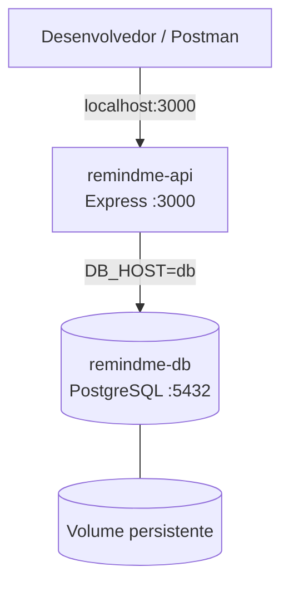
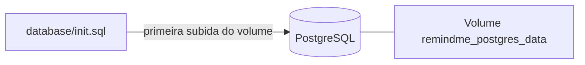

# Docker & Azure — Remind.me API

Guia complementar ao **[README.md](./README.md)**. Foco em containers, testes e evidências para relatório.

---

## Arquitetura local



---

## Comandos

```bash
# Subir (build + start)
docker compose up --build

# Segundo plano
docker compose up --build -d

# Status / logs / parar
docker compose ps
docker logs -f remindme-api
docker compose down
docker compose down -v   # apaga volume do banco
```

---

## Endpoints (testes)

| Método | URL |
|--------|-----|
| GET | http://localhost:3000/ |
| GET | http://localhost:3000/health |
| GET | http://localhost:3000/tasks |
| POST | http://localhost:3000/tasks |

### Postman — POST `/tasks`

- **Body** → raw → JSON:

```json
{
  "title": "Estudar Docker",
  "description": "Atividade com Docker Compose e Azure"
}
```

- **Headers:** `Content-Type: application/json`
- Resposta esperada: **201 Created**

### PowerShell

```powershell
Invoke-RestMethod -Method POST -Uri http://localhost:3000/tasks `
  -ContentType "application/json" `
  -Body '{"title":"Estudar Docker","description":"Atividade com Docker Compose e Azure"}'
```

---

## Persistência



- `init.sql` roda só na **primeira** criação do volume.
- A API também executa `initDatabase()` no startup (importante no **Azure ACI**).

---

## Azure

| Ambiente | `DB_HOST` |
|----------|-----------|
| Docker Compose | `db` |
| ACI (mesmo container group) | `localhost` |

Exemplo de deploy: arquivo [`aci.yaml`](./aci.yaml) na raiz.

Fluxo ACR → ACI: seção **Azure** no [README.md](./README.md).

---

## Prints sugeridos (relatório)

1. `docker compose up --build` — Fig. execução Compose  
2. `docker compose ps` — Fig. containers rodando  
3. Navegador `GET /health` — Fig. comunicação API ↔ banco  
4. Postman `POST /tasks` — Fig. cadastro de tarefa  
5. `docker volume ls` — persistência  

---

← Voltar ao [README principal](./README.md)
